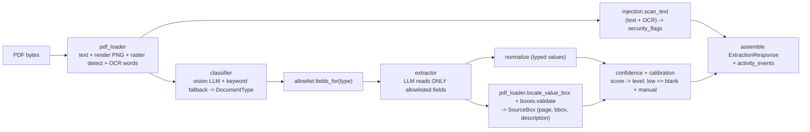

# AI Developer 1 — Architecture & Tech Stack

Scope: everything from **"renter uploads a document"** to **"structured profile
evidence + conflicts ready for confirmation."** Nothing downstream (rules,
calculation, readiness, safety, packet) is ours.

---

## 1. Tech stack (my part)

| Concern | Choice | Notes |
|--------|--------|-------|
| Language | **Python 3.10+** | same runtime family as Dev 2, easy to co-host |
| HTTP API | **FastAPI + Uvicorn** (ASGI) | `POST /internal/ai/extract`, `POST /internal/ai/reconcile`; auto OpenAPI at `/docs`, `/openapi.json` |
| Multipart | **python-multipart** | PDF upload on `/extract` |
| Contracts / validation | **Pydantic v2** | `contracts/extraction_contract.py` (frozen, shared with Dev 2) |
| PDF handling | **PyMuPDF (fitz)** | text-layer extraction, rasterization detection, page render → PNG @150 DPI |
| OCR (image-only PDFs) | **rapidocr-onnxruntime** (RapidOCR/ONNX) | line-level boxes → converted to PDF points (bottom-left origin) |
| Vision model | **OpenAI Chat Completions**, `gpt-4o` / `gpt-4o-mini`, JSON mode | classification + allowlisted extraction; injected via a `VisionLLM` port |
| Images | **Pillow** | image handling for the model input |
| Confidence calibration | custom **histogram model** (`calibration.py`) | fitted vs organizer gold, persisted to `calibration_data.json` |
| Pure logic (no I/O) | `allowlist`, `normalize`, `boxes`, `injection` (regex), `confidence`, `activity`, `profile_reconciliation/*` | deterministic, unit-tested |

**Design principle:** the only I/O is PDF loading and the (injected) model/OCR.
Everything else is pure and deterministic, so it's testable and merge-safe.

---

## 2. How my stack connects to Dev 2 and full-stack once merged

- **My service** is an internal HTTP microservice (FastAPI). It does **not** call
  anything downstream and holds **no session state**.
- **Full-stack** owns the browser app + a backend that holds the **shared session
  object** and **state machine** (FR4.1). It calls my two endpoints, runs the
  confirm/edit workflow, builds the **deterministic calculation engine** and the
  **MTSP threshold lookup**, and calls Dev 2.
- **Dev 2** owns the Rules & Chat, Readiness, and Safety agents. It consumes my
  `DocumentExtractionResult` + conflict objects (via full-stack's session object)
  to produce citations, readiness status, and the safety gate.
- **The contract is the seam:** `extraction_contract.py` (Pydantic) is imported by
  both AI Dev 1 and AI Dev 2; full-stack consumes the same shapes as JSON.

### System integration diagram

```mermaid
flowchart TD
    R[Renter] -->|uploads PDF| FS[Full-stack app + session store + state machine]

    subgraph DEV1["AI Developer 1 (my service — FastAPI)"]
        direction TB
        EX["POST /internal/ai/extract\nDocument Evidence Agent"]
        RC["POST /internal/ai/reconcile\nProfile Reconciliation Agent"]
    end

    FS -->|"file + document_id + session_id"| EX
    EX -->|ExtractionResponse: fields, boxes, confidence, security_flags| FS
    FS -->|"documents[]"| RC
    RC -->|conflicts[] + activity_events| FS

    FS -->|renders boxes, confidence, banner| R
    R -->|confirm / edit / resolve conflicts| FS

    subgraph FSD["Full-stack (deterministic, code-only)"]
        CALC["Calc engine\nhousehold_size -> MTSP lookup -> annualization"]
    end
    FS --> CALC

    subgraph DEV2["AI Developer 2"]
        RULES["Rules & Chat Agent\ncitations + effective date"]
        READY["Readiness Agent\nchecklist + status + next steps"]
        SAFE["Safety & Report Agent\nfinal gate"]
    end
    FS -->|confirmed profile + conflicts + calc results| RULES
    RULES --> READY
    CALC --> READY
    READY --> SAFE
    SAFE -->|approved outputs| FS
    FS -->|packet export PDF/ZIP| R
```

### My internal pipeline (inside `/extract`)



Reconciliation (`/reconcile`) is separate and pure: it takes the assembled
`DocumentExtractionResult[]` and runs per-document (gross-total) + cross-document
(pay-frequency, gross-pay, duplicate-period, person-name) detectors, emitting
`StructuredConflict[]` — it never decides which value is correct.

---

## 3. Where my responsibility ends (per step)

| Step | Owner |
|------|-------|
| Anonymous session, consent, upload UI, file-format reject | Full-stack |
| **Classify document type** | **AI Dev 1** |
| **Extract allowlisted fields + page + bbox + confidence** | **AI Dev 1** |
| **Injection detection + security_flags** | **AI Dev 1** |
| **Accessible source descriptions** | **AI Dev 1** |
| Render boxes / confidence / banner; confirm & edit; hold confirmed values | Full-stack |
| **Cross-document conflict objects** | **AI Dev 1** |
| Side-by-side conflict UI; block calc until resolved | Full-stack |
| MTSP threshold lookup + annualization (deterministic) | Full-stack |
| Rules citations / readiness status / safety gate | AI Dev 2 |
| Packet preview / export | Full-stack |

**My output is an *input* to the organizer's final `submission.schema.json`
(`annualized_income`, `comparison`, `readiness_status`, `citations`) — I do not
produce that record; full-stack + Dev 2 do.**
