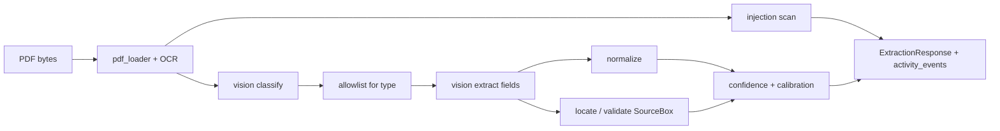

# RealDoor AI — Summary

Overall AI workflow, architecture, and tech stack for the unified service
deployed from this repo. Detailed request/response shapes live in
[`INTEGRATION.md`](./INTEGRATION.md). Older Dev-1-only notes remain in
[`ARCHITECTURE.md`](./ARCHITECTURE.md) for reference.

---

## 1. Overall AI workflow

The product path is: **upload → extract → confirm → reconcile → resolve →
calculate (FS) → explain/ask → readiness → safety → packet (FS)**.

```mermaid
flowchart TD
    R[Renter] -->|upload PDF| FS[Full-stack session + UI]

    subgraph AI["Unified AI service (FastAPI)"]
        EX["1. POST /internal/ai/extract\nDocument Evidence Agent"]
        RC["3. POST /internal/ai/reconcile\nProfile Reconciliation Agent"]
        ASK["6–7. POST /internal/ai/ask\nRules & Chat Agent\n(citations folded in)"]
        READY["8. POST /internal/ai/readiness\nReadiness Agent"]
        SAFE["9. POST /internal/ai/safety-check\nSafety & Report Agent"]
    end

    FS -->|file + document_id + session_id| EX
    EX -->|fields, boxes, confidence, security_flags| FS
    FS -->|confirm / edit| R
    R -->|confirmed values| FS
    FS -->|documents[]| RC
    RC -->|conflicts[]| FS
    FS -->|resolve conflicts| R

    subgraph FSD["Full-stack deterministic (not AI)"]
        CALC["5. MTSP lookup + annualization"]
        PACKET["10. Packet export\nsubmission.schema.json"]
    end

    FS --> CALC
    CALC --> FS
    FS -->|question + calc context| ASK
    ASK -->|answer + citations + effective_date| FS
    FS -->|profile + conflicts + calc + docs| READY
    READY -->|status + checklist + submission| FS
    FS --> SAFE
    SAFE -->|PASS / BLOCKED| FS
    FS --> PACKET
    PACKET --> R
```

| Step | Owner | Endpoint / action |
|------|-------|-------------------|
| 1. Upload + classify + extract allowlisted fields + boxes + injection scan | AI | `POST /internal/ai/extract` |
| 2. Confirm / edit | FS + renter | no AI call |
| 3. Cross-document conflict detection | AI | `POST /internal/ai/reconcile` |
| 4. Resolve conflicts | FS + renter | no AI call |
| 5. Calculate income vs MTSP threshold | FS (deterministic) | no AI call |
| 6. Explain calc (citation + effective date) | AI | `POST /internal/ai/ask` |
| 7. Open Q&A | AI | `POST /internal/ai/ask` |
| 8. Readiness checklist / status | AI | `POST /internal/ai/readiness` |
| 9. Safety gate | AI | `POST /internal/ai/safety-check` |
| 10. Packet export | FS | no AI call |

**Design rules baked into the workflow**

- LLM never invents a threshold or annualized income — calc is code.
- Unconfirmed / low-confidence values are never treated as truth.
- Conflicts are surfaced, not adjudicated by the model.
- Eligibility / approval / scoring language is blocked by safety.
- Citations must trace to the frozen `rule_corpus.jsonl`.

---

## 2. Architecture

### Service shape

- **One** ASGI process (`backend/serve.py` → `backend.ai.api:create_app`).
- Five AI routes + `/health` + OpenAPI (`/docs`).
- **Stateless:** FS owns session, confirmed profile, and state machine.
- **Two extract run modes:** real OpenAI (`OPENAI_API_KEY`) or `--gold`
  (offline, gold-backed fake for CI / local without a key).
- **Pack path aliases:** `REALDOOR_PACK_ROOT` ↔ `REALDOOR_ORGANIZER_PACK`
  (either name works).
- **CORS:** `CORSMiddleware` enabled; origins via `REALDOOR_CORS_ORIGINS`
  (default `*`).

### Internal modules

| Area | Package |
|------|---------|
| HTTP surface | `backend/ai/api.py` |
| Dev-2 adapters | `backend/ai/api_adapter.py` |
| Document Evidence | `backend/ai/document_evidence/` |
| Profile Reconciliation | `backend/ai/profile_reconciliation/` |
| Rules & Chat | `backend/ai/rules_chat/` |
| Readiness | `backend/ai/readiness/` |
| Safety | `backend/ai/safety/` |
| Orchestration | `backend/ai/orchestration/` |
| Deterministic calc (FS-owned logic, co-located) | `backend/calculations/` |
| Schema adapters (Flag 3, evaluation request, submission) | `backend/integration/` |
| Frozen extract contract | `contracts/extraction_contract.py` |
| Organizer ground truth / rules / schemas | `organizer_pack/` |

### Extract pipeline (inside `/extract`)



### Contracts at the seams

- **Extract wire format** = `ExtractionResponse` (frozen Pydantic contract).
- **Gold / organizer document shape** = `document_gold.schema.json`
  (mapped by `document_summary_builder` — Flag 3).
- **Final packet shape** = `submission.schema.json`
  (readiness validates `organizer_submission` against it).
- **Rules** = `organizer_pack/rules/rule_corpus.jsonl`.
- **Thresholds** = `organizer_pack/data/mtsp_2026_boston_cambridge_quincy.csv`.

---

## 3. Tech stack

| Concern | Choice |
|--------|--------|
| Language | Python **3.11+** (`StrEnum`; Render pin via `runtime.txt` → 3.11.9) |
| HTTP | **FastAPI** + **Uvicorn** (ASGI) |
| CORS | FastAPI / Starlette **`CORSMiddleware`** |
| Multipart uploads | **python-multipart** |
| Validation | **Pydantic v2** + **jsonschema** (submission) |
| PDF | **PyMuPDF (fitz)** — text, raster detect, page PNG @150 DPI, box locate |
| OCR (image-only PDFs) | **rapidocr-onnxruntime** |
| Vision LLM | **OpenAI** Chat Completions (`gpt-4o-mini` default) via injectable `VisionLLM` port |
| Images | **Pillow** |
| Confidence | Histogram calibration (`calibration_data.json`, FR1.13) |
| Offline test extract | Gold-backed fake LLM (`GoldBackedLLM`) |
| Deploy | Render (`render.yaml`: build = deps + `calibrate.py --offline`, start = uvicorn factory) |

**Principle:** the only non-deterministic I/O on the extract path is the vision
model (and optional OCR). Reconciliation, rules retrieval, readiness, safety,
and calculation are deterministic and unit-tested.

---

## 4. Environment variables

| Variable | Required | Purpose |
|----------|----------|---------|
| `OPENAI_API_KEY` | yes (prod extract) | Real vision model |
| `REALDOOR_VISION_MODEL` | no | Default `gpt-4o-mini` |
| `REALDOOR_PACK_ROOT` **or** `REALDOOR_ORGANIZER_PACK` | yes on deploy | Path to `organizer_pack` (mutual aliases) |
| `REALDOOR_CORS_ORIGINS` | no | Comma-separated origins; default `*` |
| `PYTHONPATH` | yes on deploy | `.` (repo root) |

---

## 5. Verification status

- All five routes live over real HTTP (curl / httpx), not only in-process helpers.
- HH-002 exercised in **real OpenAI mode** end-to-end (extract → reconcile → ask → readiness → safety-check).
- Full suite: **85 passed** (including HTTP + all 24 adversarial cases through `/ask`).
- Challenge formats for extract, document gold mapping, and submission validated in integration tests.

For FS integration details and copy-paste request/response examples, use
[`INTEGRATION.md`](./INTEGRATION.md).
